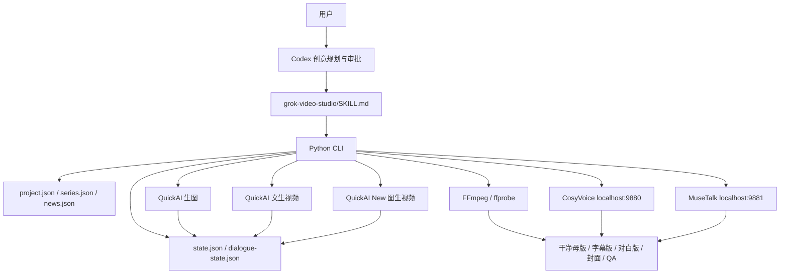

# Grok Video Studio v1.8.0 开发交接文档

> 交接日期：2026-08-28  
> 交接基线：`main` 分支，提交 `4f9b0a1` 及其后仅包含本文档的提交  
> 仓库：`https://github.com/1582345746/GrokVideoSkill.git`  
> 本机工作区：`E:\MyFiles\ToolSkills\GrokVideoSkill`  
> 当前产品策略：优先使用 Codex 拉取仓库并安装；独立安装器路线已冻结  
> 安全要求：本文档不包含任何真实 API Key，新会话也不得回显、复制或写入 Key

## 目录

1. 接手摘要
2. 新会话接手后的第一轮动作
3. 产品定位与总体架构
4. 产品路线与内部创意预设
5. 模块完成度总表
6. 核心合同与实现细节
7. 音频、字幕、配音与口型
8. 本机安装与第三方依赖状态
9. 真实测试、样片与验收证据
10. 自动化测试与 CI
11. 仓库文件地图
12. 已知限制和风险
13. 已冻结或暂缓事项
14. 下一阶段建议开发清单
15. 常用开发和诊断命令
16. 开发纪律与安全边界
17. 新对话启动话术
18. 下一阶段完成定义

## 1. 接手摘要

Grok Video Studio 是一个供 Codex 调用的、可恢复的 AI 视频制作技能。Codex 负责理解需求、联网研究、写剧本、拆分镜头、编写提示词、组织人工审批和解释结果；Python CLI 负责项目合同、凭据、付费请求、任务轮询、下载、断点恢复、预算门禁、音视频处理和技术 QA。

当前版本为 `v1.8.0`。仓库已经从多个开发分支合并为唯一 `main` 分支。不要重新建立长期功能分支；用户明确希望 GitHub 只保留 `main`。

当前已经形成四条产品路线：

1. 文生视频。
2. 图生视频，包括用户现成图片动画、角色母版和逐镜头关键帧。
3. 连续剧，按整季规划、逐集审批、逐集验收和连续性状态推进。
4. 新闻视频，先建立来源与事实主张合同，再进入标准视频生成流程。

当前已经形成五种音频模式：

1. `preserve`：保留上游或源视频音频。
2. `mute`：明确生成静音交付。
3. `native-dialogue`：由视频上游生成对白和口型。
4. `local-voice`：CosyVoice 精确配音、时间轴、混音和字幕。
5. `local-lipsync`：CosyVoice 精确配音后使用 MuseTalk 修正口型。

字幕来源与音频模式相互独立：

- `upstream`：保留上游或源画面已有字幕，不生成本地 SRT。
- `project`：根据已批准的对白、旁白或字幕时间轴生成确定性 SRT。
- `none`：不交付字幕。

最重要的接手判断：代码功能面已经较完整，但“每个模块都达到用户产品体验”的真实付费验收尚未全部完成。自动化测试通过不能替代人物一致性、口型、对白准确性、字幕安全区和新闻表达的人工验收。

## 2. 新会话接手后的第一轮动作

新会话不要直接改代码。先执行以下只读检查并向用户报告：

1. 完整阅读本文档、`README.md`、`grok-video-studio/SKILL.md` 和 `docs/testing-and-usage-guide.zh-CN.md`。
2. 运行 `git status --short`，确认没有用户未提交修改。
3. 运行 `git branch -a -vv`，确认只有 `main` 和 `origin/main`。
4. 运行 `git pull --ff-only origin main`，禁止用 reset 覆盖工作区。
5. 运行技能 `version`、`doctor`、`capabilities`。
6. 运行 `components-doctor --profile full-dialogue`。当前服务停止时总状态会是 `ok=false`，必须区分“服务未运行”和“源码/模型缺失”。
7. 运行本地测试和技能规范校验，确认基线没有退化。
8. 未经用户明确批准，不发起生图、生视频、模型下载、Docker 构建或服务启动。

旧交接文档 `HANDOFF-T2V-I2V-PROVIDER-ADAPTER.zh-CN.md` 记录了 v1.2 左右的协议适配背景，其中大量“待实现”已经完成。它只能作为历史资料，不能作为当前完成度依据。

## 3. 产品定位与总体架构



设计原则：

- 创意内容由 Codex 生成并让用户审核，不把剧本逻辑硬编码进 Python。
- 付费请求、任务 ID、结果和重试原因必须持久化，不能依赖聊天记忆。
- 图片和视频创建视为计费写操作，不自动重试不确定的 POST。
- 每个项目都保留干净母版；字幕、配音、口型和后期是可逆衍生物。
- 技术 QA 与人工观片、听审分开记录。
- 用户图片动画仍属于图生视频，不创建第五条产品路线。

## 4. 产品路线与内部创意预设

### 4.1 四条产品路线

| 路线 | 项目入口 | 默认提供方 | 当前状态 |
| --- | --- | --- | --- |
| 文生视频 | `init --mode text-to-video` | QuickAI | 已实现并有真实上游样片 |
| 图生视频 | `init --mode image-to-video` | QuickAI New | 已实现并有真实单图上游冒烟测试 |
| 连续剧 | `series-init` | 每集选择 T2V 或 I2V | 生命周期已实现，完整多集真实验收待做 |
| 新闻视频 | `news-init` | 标准 T2V 或 I2V | 证据门禁已实现，完整真实新闻成片待做 |

### 4.2 内部创意预设

预设位于 `grok-video-studio/assets/workflow-templates/`：

- `general-video`
- `text-to-video`
- `single-image-animation`
- `character-consistent-story`
- `dance-performance`
- `comedy-action`
- `product-ad`
- `scene-animation`
- `short-drama`
- `news-video`

预设用于问题引导和提示词规则，不改变四条产品路线。`single-image-animation` 是 I2V 预设；`short-drama` 可以是单集标准项目，不必创建系列项目。

## 5. 模块完成度总表

状态含义：

- “已实现”：代码和合同存在。
- “自动化通过”：包含在 61 项测试或 CI 中。
- “真实跑过”：使用真实上游或真实 GPU 执行过。
- “产品验收待补”：仍需要按用户体验标准观察成片或听审。

| 模块 | 已实现 | 自动化通过 | 真实跑过 | 当前结论 |
| --- | --- | --- | --- | --- |
| QuickAI 文生视频 | 是 | 是 | 是 | 可用；严格人物一致性仍需 I2V |
| QuickAI New 用户图片 I2V | 是 | 是 | 是 | 协议可用；需补当前版本完整视觉验收 |
| QuickAI 生图 | 是 | 是 | doctor 通过 | 角色母版/关键帧真实成片链路仍需系统验收 |
| 多镜头项目 | 是 | 是 | 60 秒项目跑过 | 旧样片暴露人物漂移、UI 和音频问题 |
| 角色母版 | 是 | 是 | 部分链路验证 | 真实跨镜头身份一致性待量化验收 |
| 多角色关键帧 | 是 | 是 | 未形成正式验收包 | 功能存在，产品视觉验收待补 |
| 连续剧生命周期 | 是 | 是 | 尚无正式三集成片 | 逻辑可用，付费多集验收待做 |
| 新闻证据合同 | 是 | 是 | 尚无正式热点成片 | 门禁可用，联网研究与成片验收待做 |
| 上游原生对白 | 是 | 是 | 是 | 有可听 AAC，但文字、口型和内嵌字幕不可控 |
| 确定性 SRT | 是 | 是 | FFmpeg 路径可用 | 来源是项目文本，不是任意视频 ASR |
| 字幕烧录 | 是 | 是 | 本地链路可用 | 必须保留干净母版并防止双层字幕 |
| CosyVoice 精确配音 | 是 | 是 | 真实 GPU 服务曾验收 | 本机模型完整；需补可复现媒体验收包 |
| MuseTalk 口型同步 | 是 | 是 | 真实 GPU 服务曾验收 | 本机模型完整；需补口型视觉验收包 |
| 拼接与音频保留 | 是 | 是 | 是 | 当前代码已修复；旧 `final.mp4` 仍是历史坏样本 |
| 后期、混音、封面 | 是 | 是 | 本地测试通过 | 仅轻量后期，不是完整剪辑时间线 |
| 预算门禁 | 是 | 是 | 项目状态可见 | 默认单价为 0 时不能代表真实费用 |
| 断点恢复 | 是 | 是 | 真实 task ID 存在 | 已有 task ID 不重复 POST |
| 媒体技术 QA | 是 | 是 | 是 | 不能自动判定人物、肢体、口型和 UI |
| 安装/修复/卸载 | 是 | 是 | 五档隔离验收过 | 安装器路线已冻结，不再优先开发 |
| 模型完整性与恢复 | 是 | 是 | 本机状态为 ready | SHA-256、磁盘预检、断点下载已实现 |
| 任意成片 ASR 转字幕 | 否 | 否 | 否 | 当前不是产品入口，Whisper 仅为 MuseTalk 依赖 |

## 6. 核心合同与实现细节

### 6.1 Provider 和凭据职责

| 职责 | Base URL | 默认模型 | 用途 |
| --- | --- | --- | --- |
| QuickAI 生图 | `https://quickai.hn.takin.cc` | `gpt-image-2` | 角色母版、镜头关键帧、图片编辑 |
| QuickAI 文生视频 | `https://quickai.hn.takin.cc` | `grok-imagine-video-1.5` | Prompt-only T2V |
| QuickAI New 图生视频 | `https://quickainew.hn.takin.cc` | `grok-imagine-video-1.5` | 用户图片或镜头关键帧动画 |

三个凭据职责分别为：

- `quickai_image_key`
- `quickai_video_key`
- `quickainew_video_key`

旧 `quickai_key` 和 `quickainew_key` 只用于兼容迁移。不要把一个提供方的 Key 发给另一个提供方，也不要在交接文档、项目、命令行或日志中写 Key。

Windows 配置使用 DPAPI；非 Windows 不持久化明文密钥，只支持运行时环境变量。

### 6.2 上游协议

QuickAI 文生视频：

- 创建：JSON `POST /v1/videos/generations`
- 查询：`GET /v1/videos/generations/{task_id}`
- 下载：`GET /v1/videos/generations/{task_id}/content`
- T2V 请求绝不发送图片字段

QuickAI New 图生视频：

- 创建：multipart `POST /v1/videos`
- 查询：`GET /v1/videos/{task_id}`
- 下载：`GET /v1/videos/{task_id}/content`
- 图片使用重复 `input_reference` 文件字段

当前合同：

- 单镜头 1-15 秒。
- 分辨率枚举：`480p`、`720p`、`1080p`。
- 常用比例：`16:9`、`9:16`、`1:1`、`4:3`、`3:4`、`2:3`、`3:2`。
- 最终合成提示词硬上限 4096 字符，建议工作上限 3800。
- 上游可能返回比请求画布更小但比例正确的帧，例如 480p 返回 `848x480` 或 `480x848`。当前 QA 应记录缩放警告，不得把方向错误当成正常。

### 6.3 项目文件

标准项目目录至少包含：

```text
project-root/
├── project.json
├── state.json
├── logs/events.jsonl
├── assets/
│   ├── references/
│   ├── characters/
│   ├── keyframes/
│   └── voices/
├── clips/
└── deliverables/
```

关键合同：

- `project.json`：创意、镜头、角色、模式、提供方、预算、音频、字幕和预期交付。
- `state.json`：任务 ID、attempt、签名、下载路径、QA、预算消耗和可恢复状态，不存 Key。
- `logs/events.jsonl`：脱敏运行事件。
- `dialogue-state.json`：逐句 TTS 缓存和恢复合同。
- `series.json`：整季设定、角色、地点、道具、每集生命周期和连续性摘要。
- `news.json`：来源、事实主张、冲突、旁白和逐镜头 claim 映射。

### 6.4 标准项目生命周期

```text
init
-> Codex 填写 project.json
-> validate / preflight / audit
-> 用户确认剧本、提示词、请求数量和预算
-> generate-character（可选）
-> generate-images（I2V 关键帧，可选）
-> generate-videos / resume
-> assemble
-> subtitles / dialogue-render / postprocess（可选）
-> qa
-> 人工观片和听审
-> 交付并保留 state.json
```

付费写操作前会先记录 attempt。创建请求超时但没有 task ID 时属于 `submission_unknown`/ambiguous，不自动重试。重新创建必须使用 `--retry-failed --retry-reason` 并得到用户明确批准。

### 6.5 人物一致性

T2V 通过简洁身份锁、服装、镜头连续性和重复提示词实现尽力而为，不能保证多镜头或多集严格一致。

严格路线：

1. 生成一张包含同一角色正面、侧面和全身视图的单张母版。
2. 每个镜头从母版派生当前场景关键帧。
3. 视频上游只接收当前镜头关键帧。
4. 不把多视角母版直接发送给视频模型。

连续剧角色母版保存在系列级目录并同步到每集。多角色镜头按 `character_ids` 选择相关母版来生成当前关键帧。

### 6.6 连续剧

连续剧不是批量无门禁生成。生命周期为：

```text
draft -> approved -> generating -> needs_review -> accepted
```

规则：

- 可以先写完整季大纲、角色和每集提示词，不产生付费请求。
- 每次只审批和生成一集。
- 前一集未 `accepted` 时，后一集不能审批。
- `series-run` 生成后停在 `needs_review`。
- `series-accept` 必须记录实际成片结尾，而不是计划结尾。
- “生成下一集”先运行 `series-next` 和 `series-context`，再预检和等待批准。

### 6.7 新闻视频

新闻搜索由运行技能的 Codex 使用当前网络完成，CLI 不自行抓取网页。CLI 负责创建和验证证据合同。

生成门禁：

- 记录真实检索词和 HTTPS 来源页。
- 记录发布者、发布时间、访问时间和来源类型。
- 关键主张需要第一手来源或两个独立发布者支持。
- 记录来源冲突及解决方式。
- 每个旁白段和镜头映射到 `claim_id`。
- `visual_rights=facts-only` 时不得下载或复用无授权新闻画面。
- 未通过 `news-validate` 时禁止标准生成。
- AI 画面必须明确为示意，不能冒充真实现场。

## 7. 音频、字幕、配音与口型

### 7.1 上游原生对白

`native-dialogue` 会把时间化对白加入视频提示词并设置 `generate_audio=true`。真实 QuickAI 测试确认能返回可听 AAC，但存在以下不确定性：

- 逐字内容可能不准确。
- 声音不可稳定复现。
- 口型不可保证。
- 上游可能无视干净画面要求，直接把对白文字烧进画面。

存在音轨不等于存在可听、正确对白。QA 只提供音量和静音比，必须实际播放听审。

### 7.2 精确字幕

`subtitles` 根据项目中的时间化对白、字幕 cue、旁白或新闻 narration 导出 SRT，并可用 FFmpeg 烧录 `clean`、`cinematic` 或 `news` 样式。

边界：

- 当前不是任意视频语音识别入口。
- MuseTalk 使用的 `whisper-tiny` 是内部特征依赖，不代表已实现 ASR 产品。
- 先导出并审校 SRT，再烧录。
- 永远保留 `deliverables/final.mp4`。
- `native-dialogue` 源视频必须先确认没有上游内嵌字幕，才允许本地烧录，防止双层字幕。

### 7.3 CosyVoice 精确配音

`local-voice`：

- 同一批准文本同时作为对白和字幕唯一来源。
- 每句生成 WAV，并根据声明时间窗做时长适配。
- 生成 `dialogue-track.wav`。
- 对白期间压低源音频并执行响度归一化。
- 逐句结果写入 `dialogue-state.json`，重复执行可复用缓存。
- 声音参考必须为 `synthetic`、`owned` 或 `licensed`，并提供准确 `reference_text`。
- 不支持未经授权克隆公众人物或第三方声音。

### 7.4 MuseTalk 口型同步

`local-lipsync` 先执行 `local-voice`，再把混合视频和对白轨发送到本机 MuseTalk。

本机 RTX 3060 Ti 只有 8 GB 显存，必须分阶段：

1. 只启动 CosyVoice，生成并缓存全部对白。
2. 停止或切换 CosyVoice。
3. 只启动 MuseTalk。
4. 重新运行 `dialogue-render`，复用缓存音频，仅执行口型。

不要同时启动两个服务。技术执行成功也不能替代人脸、嘴部闪烁、牙齿、下巴和身份稳定性的人工检查。

### 7.5 拼接和后期

当前支持：

- 任意数量 MP4 归一化和拼接。
- H.264、`yuv420p`、30 fps 输出。
- `audio_policy=preserve|mute`。
- 无音轨片段插入静音 AAC，避免整条 concat 丢失其他音频。
- 背景音乐、旁白、SRT、淡入淡出。
- 封面帧导出。

当前不支持完整 NLE 时间线、复杂转场、动态图形、逐字卡拉 OK 字幕或高级对白剪辑。此类需求需要单独的剪辑能力，不应假装现有轻量后期可以完成。

## 8. 本机安装与第三方依赖状态

以下状态在 2026-08-28 实际核对。

### 8.1 路径

| 内容 | 路径 | 状态 |
| --- | --- | --- |
| Git 工作区 | `E:\MyFiles\ToolSkills\GrokVideoSkill` | 存在，`main` |
| 已安装技能 | `C:\Users\FBX\.codex\skills\grok-video-studio` | v1.8.0 |
| 用户配置目录 | `C:\Users\FBX\AppData\Local\GrokVideoSkill` | 存在 |
| 非秘密配置 | `...\config.json` | 存在 |
| DPAPI 密钥 | `...\secrets.dpapi` | 存在，不得读取或复制内容 |
| 安装档位 | `...\install-profile.json` | 当前 `basic` |
| 组件配置 | `...\components.json` | 指向 E 盘 full-dialogue 资源 |
| 组件源码根 | `E:\AI-Services\src` | 存在 |
| 模型根 | `E:\AI-Services\models` | 存在 |
| 模型状态 | `E:\AI-Services\models\.gvs-model-state.json` | 全部 ready |
| FFmpeg | `D:\ffmpeg-7.0.2-essentials_build\bin\ffmpeg.EXE` | 可用 |
| ffprobe | `D:\ffmpeg-7.0.2-essentials_build\bin\ffprobe.EXE` | 可用 |

安装档位为 `basic` 只代表新项目默认保留上游音频，不代表本机缺少精确配音或口型能力。组件配置和模型已经存在，可在具体项目中显式选择 `local-voice` 或 `local-lipsync`。

### 8.2 GPU 和 Docker

- GPU：NVIDIA GeForce RTX 3060 Ti。
- 显存：8192 MiB。
- 驱动：591.86。
- Docker Desktop、WSL2 和 GPU passthrough 已验证可用。
- 当前 `gvs-cosyvoice-service` 和 `gvs-musetalk-service` 未运行。
- `components-doctor` 因服务健康检查失败返回 `ok=false` 是预期待机状态；源码和模型分别为 ready。

已有 Docker 镜像：

| 镜像 | 观察大小 |
| --- | --- |
| `gvs-cosyvoice:074ca6dc9e80` | 约 35.7 GB |
| `gvs-musetalk:0a89dec45a01` | 约 27.9 GB |

不要因为服务停止而重新构建镜像或重新下载模型。先检查镜像、source commit 和模型状态；只有缺失或完整性失败时才提出修复计划。

### 8.3 固定源码和模型

| 组件 | 仓库/模型 | 固定版本 | 本机状态 |
| --- | --- | --- | --- |
| CosyVoice 源码 | `FunAudioLLM/CosyVoice` | `074ca6dc9e80a2f424f1f74b48bdd7d3fea531cc` | ready |
| CosyVoice 模型 | `FunAudioLLM/Fun-CosyVoice3-0.5B-2512` | `29e01c4e8d000f4bcd70751be16fa94bf3d85a18` | 9,747,380,365 bytes，ready |
| MuseTalk 源码 | `TMElyralab/MuseTalk` | `0a89dec45a0192b824e3cf4daf96c239440c5ed8` | ready |
| MuseTalk 主模型 | `TMElyralab/MuseTalk` | `3ef28bc5cff08c90ad8178a25f1b570cd800170f` | 4,888,095,500 bytes，ready |
| VAE | `stabilityai/sd-vae-ft-mse` | `31f26fdeee1355a5c34592e401dd41e45d25a493` | 334,707,764 bytes，ready |
| Whisper 依赖 | `openai/whisper-tiny` | `169d4a4341b33bc18d8881c4b69c2e104e1cc0af` | 151,282,000 bytes，ready |
| DWPose | `yzd-v/DWPose` | `1a7144101628d69ee7a3768d1ee3a094070dc388` | 406,878,486 bytes，ready |
| Face parse | `ManyOtherFunctions/face-parse-bisent` | `0073b233a5a3c4b1377d4dbf49245017938a72b5` | 100,116,983 bytes，ready |

模型安装器具备：

- 512 MiB 安全余量的磁盘预检。
- Hugging Face 缓存断点恢复。
- revision、必需文件、字节数和 SHA-256 状态记录。
- 完整已有目录免下载采用。
- manifest 新增必需文件时的状态迁移。
- 损坏文件检测和模型级修复。
- 启动服务前的必需文件检查。

### 8.4 其他参考代码库

旧协议开发曾参考以下本机项目：

- `E:\MyFiles\QuickAiCanvas`
- `E:\MyFiles\Sub2ApiTransfer`
- `E:\MyFiles\NewApiTransfer`

它们用于核对前端或中转站协议。除非用户明确授权，不要修改 Sub2API/NewApi 或把本技能问题转嫁给上游项目。

## 9. 真实测试、样片与验收证据

### 9.1 当前可复用测试目录

| 目录 | 内容 | 结论 |
| --- | --- | --- |
| `E:\TEMP\gvs-real-t2v-20260827` | 1 秒 QuickAI T2V 冒烟 | 任务完成；旧 QA 画布期望导致尺寸错误记录 |
| `E:\TEMP\gvs-real-i2v-20260827` | 1 秒 QuickAI New 单图 I2V | 任务完成；旧 QA 画布期望导致尺寸错误记录 |
| `E:\TEMP\gvs-t2v-qa-20260828` | 当前 QA 逻辑的 1 秒 T2V | 技术 QA 通过，848x480，H.264，AAC |
| `E:\MyFiles\ToolSkills\GrokVideoSkill\projects\rural-city-60s` | 六镜头 60 秒竖屏故事 | 真实生成，作为回归案例，不是合格产品样片 |
| `E:\TEMP\gvs-installer-acceptance-6dcdc441caf34885a423c0a5154d7a1e` | 五档安装、修复、锁文件和失败回滚 | 安装器验收证据 |
| `E:\TEMP\gvs-interactive-acceptance-079beec7804548fd84f062a8249c3d49` | 交互安装和 DPAPI 配置 | 交互验收证据 |
| `E:\TEMP\gvs-model-acceptance-config` | 真实模型状态采用测试配置 | 模型完整性验收辅助 |

### 9.2 60 秒农村小伙进城样片

项目：`projects/rural-city-60s`

- 六个 10 秒左右镜头。
- 最终画面约 60.2 秒，`480x848` 竖屏。
- 每个上游片段含 AAC 音轨。
- 旧 `deliverables/final.mp4` 因早期拼接逻辑只有视频流，无音轨，技术 QA 失败。
- `deliverables/final-v1.4.mp4` 已通过更新后的拼接逻辑保留 AAC，约 60.27 秒。
- 最后一段出现短视频点赞、评论等 UI 元素，属于不合格视觉结果。
- T2V 多镜头人物身份仍有漂移风险。

该项目应继续保留，作为以下回归测试：

1. 拼接不能丢音频。
2. `allow_ui_elements=false` 仍需人工检查。
3. 技术 QA 通过不能替代内容 QA。
4. 严格人物一致性应切换角色母版 + I2V。

### 9.3 本地 GPU 验收说明

提交 `86bd3ee feat: complete local dialogue GPU acceptance` 是基于真实 CosyVoice/MuseTalk GPU 部署问题修复形成的，包括 Docker 兼容、模型布局、服务健康、8 GB 分阶段切换和缓存复用。

本轮核对确认源码、模型和镜像仍在，但没有在仓库内发现一个完整、脱敏、可复现的“输入视频 + 参考音频 + CosyVoice 输出 + MuseTalk 输出 + QA 报告”验收包。下一阶段必须重新生成这样一个持久化验收包，不能只引用聊天记录或提交信息。

## 10. 自动化测试与 CI

### 10.1 本地与 CI

- Python 单元/集成测试：61 项。
- Windows 开发机：已通过。
- GitHub Actions：Windows 和 Ubuntu 均运行完整测试。
- PowerShell 安装器解析和只读 smoke test：已配置。
- GitHub secret-pattern scan：已配置。
- 当前基线 CI：`https://github.com/1582345746/GrokVideoSkill/actions/runs/33178506478`，成功。
- 仓库默认分支：`main`。
- 远端当前只保留 `main`。

### 10.2 测试覆盖重点

61 项测试覆盖：

- T2V/I2V provider 路由和协议字段。
- 三种凭据职责不串用。
- 单 Key/旧配置兼容。
- Prompt 4096 字符和视频参数限制。
- 干净画面门禁。
- 多参考图和多角色关键帧。
- 角色母版不会直接发给视频模型。
- 预算门禁和 ambiguous create。
- task ID 恢复和显式失败重试。
- 音频保留/静音拼接。
- 字幕导出、烧录和 native 双字幕保护。
- CosyVoice 时间轴、缓存和声音授权。
- MuseTalk 模型布局、服务健康和 8 GB 分阶段。
- 连续剧生命周期和共享角色母版。
- 新闻来源与 claim 验证。
- 后期、封面、QA 和审阅帧。
- DPAPI 明文隔离。
- 五档安装配置、模型状态、磁盘预检、源码更新回滚。

自动化尚不能评价：

- 人物是否像同一个人。
- 运动、手指、牙齿和口型是否自然。
- 上游实际说了什么。
- 字幕是否遮挡主体或符合审美。
- 新闻表达是否误导。

## 11. 仓库文件地图

### 根目录

| 文件 | 用途 |
| --- | --- |
| `README.md` | 用户产品入口、安装和常用话术 |
| `HANDOFF-GROK-VIDEO-STUDIO-v1.8.0.zh-CN.md` | 当前总交接文档 |
| `HANDOFF-T2V-I2V-PROVIDER-ADAPTER.zh-CN.md` | 早期协议历史，已过时 |
| `install.ps1` | Windows 安装、修复、检查、卸载和可选组件流程 |
| `build-release.ps1` | ZIP、版本清单、SHA-256 和可选 Authenticode 签名 |
| `tests/test_grok_video_studio.py` | 61 项主测试 |
| `.github/workflows/ci.yml` | 跨平台 CI、安装器检查和 secret scan |
| `.github/workflows/release.yml` | tag 触发的发布构建，当前未正式使用 |

### 技能目录

| 文件/目录 | 用途 |
| --- | --- |
| `grok-video-studio/SKILL.md` | Codex 运行技能的核心指令 |
| `agents/openai.yaml` | 技能 UI 元数据 |
| `assets/install-profiles.json` | 五种用户安装档位 |
| `assets/components.json` | CosyVoice/MuseTalk 源码和模型固定版本 |
| `assets/workflow-templates/` | 十个内部创意预设 |
| `assets/docker/` | 两个隔离 Docker runtime |
| `references/api-contracts.md` | 上游 API 合同 |
| `references/project-schema.md` | 标准项目合同 |
| `references/series-schema.md` | 连续剧合同 |
| `references/news-schema.md` | 新闻证据合同 |
| `references/dialogue-and-components.md` | 对白、本地服务和授权规则 |
| `references/prompt-contract.md` | 提示词结构和干净画面要求 |
| `references/error-matrix.md` | 错误处理与计费风险 |

### Python 模块

| 模块 | 责任 |
| --- | --- |
| `grok_video_studio.py` | CLI、项目验证、生成、状态、拼接、QA、字幕 |
| `media_client.py` | QuickAI 图片、QuickAI JSON 视频、QuickAI New multipart 视频 |
| `provider_contracts.py` | 异步任务 ID、状态、进度、错误和结果 URL 解析 |
| `gvs_common.py` | DPAPI、配置、HTTP、multipart、下载、MP4 校验和脱敏 |
| `media_tools.py` | FFmpeg/ffprobe、音频分析、混音、字幕、封面和审阅帧 |
| `series_workflow.py` | 连续剧初始化、审批、上下文、接受和下一集 |
| `news_workflow.py` | 新闻证据合同创建和验证 |
| `dialogue_workflow.py` | 对白验证、CosyVoice 缓存、混音和口型工作流 |
| `audio_client.py` | 本机 CosyVoice/MuseTalk HTTP 客户端 |
| `component_manager.py` | 源码、Docker、模型、服务和完整性状态 |
| `install_profiles.py` | 五档能力规划和保存 |
| `services/cosyvoice_server.py` | CosyVoice localhost wrapper |
| `services/musetalk_server.py` | MuseTalk localhost wrapper |

## 12. 已知限制和风险

### P0：必须明确告知用户

- 创建图片或视频可能收费；所有真实测试先预检并等待批准。
- T2V 人物一致性只是尽力而为。
- native 对白的逐字、声音、口型和内嵌字幕不可控。
- 技术 QA 不会自动发现所有人物漂移、肢体异常或界面元素。
- 旧 60 秒 `final.mp4` 无音轨，不是当前代码再次失败；修复版为 `final-v1.4.mp4`。
- 服务停止时 `components-doctor ok=false` 不等于模型缺失。

### 当前产品缺口

- 没有任意视频 ASR 转字幕产品入口。
- 没有正式的三集真实连续剧验收。
- 没有正式的当前热点新闻成片验收。
- 没有持久化的 CosyVoice + MuseTalk 全链路媒体验收包。
- 角色母版和多角色关键帧尚缺真实视觉指标和对照测试。
- 没有高级剪辑时间线。
- 真实上游成本单价没有统一配置；`estimated_cost=0` 可能只是未填写预算单价。
- 上游输出尺寸可能低于请求分辨率，需要如实报告。
- 上游可能生成 UI、文字或水印，即使提示词禁止，必须人工审阅。

### 安全风险

- 用户过去在聊天截图中展示过完整 Key。如果截图曾公开，应轮换 Key。
- 不能因为用户曾在旧对话授权，就假定新对话可以无限付费测试。新会话应再次确认具体测试范围和请求预算。
- 不要读取、打印或提交 `secrets.dpapi` 内容。
- 项目、state、events、测试 fixture 和文档必须拒绝 Key 形状字符串。

## 13. 已冻结或暂缓事项

用户已经决定冻结独立安装器路线，优先维护 Codex 拉取代码安装。

已实现但暂不继续扩张：

- 五档交互安装。
- 安装检查、修复、卸载和回滚。
- 可选系统依赖安装。
- 发布 ZIP、版本清单和 SHA-256。
- 可选 Authenticode 签名入口。

未完成且明确暂缓：

- 正式代码签名证书。
- 已签名公开安装包。
- 五档全新机器矩阵验收。
- GitHub tag 和正式 Release。

除非用户重新开启安装器目标，不要把开发时间投入上述事项。

## 14. 下一阶段建议开发清单

### P0：全面真实模块验收

按 `docs/testing-and-usage-guide.zh-CN.md` 执行，建议每次只验收一个模块并建立脱敏报告。

1. 当前版本 6 秒 T2V 单镜头。
2. 用户现成图片 6 秒 I2V，不调用生图。
3. 一张角色母版、两个关键帧、两个 I2V 镜头的人物一致性对照。
4. native 对白的逐字听审、口型和内嵌字幕记录。
5. 项目 SRT 的三种样式和安全区验收。
6. CosyVoice 精确配音的缓存、响度、文本和授权验收。
7. MuseTalk 分阶段口型验收。
8. 三集、每集 20-30 秒的迷你连续剧生命周期验收。
9. 24 秒当前热点新闻证据和成片验收。
10. 拼接、混音、后期、封面和断点恢复回归。

建议新增 `docs/acceptance/`，每个模块保存：

- 脱敏请求计划。
- 项目路径和 Git commit。
- 实际请求数和 task ID 的非敏感部分或完整 task ID（确认不具备凭据能力后）。
- 媒体元数据。
- 自动 QA。
- 人工画面/听审结论。
- 发现问题和修复 commit。

不要把大体积视频提交进 Git；文档记录本机绝对路径和校验和即可，或者使用 GitHub Release/外部对象存储后再讨论。

### P1：产品效果优化

- 为角色母版、关键帧和跨镜头一致性建立评分表。
- 改进人物身份锁、服装变化和相邻镜头上下文压缩。
- 为 native 对白增加更明确的听审结果记录字段。
- 为字幕增加安全区、每行字数、断句和字体可用性预检。
- 为新闻成片增加固定的“AI 示意”本地叠加，而不是依赖视频模型绘制文字。
- 为真实上游预算配置可维护单价，避免费用估计永远为 0。

### P2：可选新能力

- 评估是否新增 ASR 模块，把任意带声音成片转成草稿字幕；必须与“项目确定性字幕”区分。
- 评估更轻量的本地 TTS/口型方案，降低其他用户安装成本。
- 评估复杂剪辑是否接入单独技能，而不是继续扩大当前 CLI。
- 评估更多视频 provider 时，继续使用适配器边界，不把模型特例堆进主流程。

## 15. 常用开发和诊断命令

在仓库根目录运行。

### Git 基线

```powershell
git status --short
git branch -a -vv
git pull --ff-only origin main
```

### 技能诊断

```powershell
python .\grok-video-studio\scripts\grok_video_studio.py version
python .\grok-video-studio\scripts\grok_video_studio.py capabilities
python .\grok-video-studio\scripts\grok_video_studio.py doctor
python .\grok-video-studio\scripts\grok_video_studio.py install-plan --profile basic
python .\grok-video-studio\scripts\grok_video_studio.py install-plan --profile lip-sync
```

### 本机组件只读检查

```powershell
python .\grok-video-studio\scripts\grok_video_studio.py components-plan --profile full-dialogue
python .\grok-video-studio\scripts\grok_video_studio.py components-doctor --profile full-dialogue
docker images
docker ps -a
nvidia-smi
```

### 8 GB GPU 分阶段启动

只有用户批准真实本地模型测试后运行：

```powershell
python .\grok-video-studio\scripts\grok_video_studio.py components-start --profile full-dialogue --component cosyvoice
python .\grok-video-studio\scripts\grok_video_studio.py components-stop --profile full-dialogue --component cosyvoice
python .\grok-video-studio\scripts\grok_video_studio.py components-start --profile full-dialogue --component musetalk
python .\grok-video-studio\scripts\grok_video_studio.py components-stop --profile full-dialogue --component musetalk
```

### 自动化验证

```powershell
python -m compileall -q .\grok-video-studio\scripts
python -m unittest discover -s tests -p "test_*.py" -v
$env:PYTHONUTF8 = "1"
python "C:\Users\FBX\.codex\skills\.system\skill-creator\scripts\quick_validate.py" .\grok-video-studio
git grep -n -I -E "sk-[A-Za-z0-9]{20,}" -- .
```

`quick_validate.py` 在中文 Windows 默认 GBK 环境下可能解码失败，设置 `PYTHONUTF8=1` 后再运行。

### 更新本机已安装技能

```powershell
.\install.ps1 -Repair -Force
.\install.ps1 -Check
```

未显式指定 `-InstallProfile` 时，修复/升级保留当前档位。凭据、项目、第三方源码和模型位于安装目录之外，不会被覆盖。

## 16. 开发纪律与安全边界

1. 只使用 `main` 分支，除非用户明确改变策略。
2. 工作区可能包含用户修改；先读 `git status`，不得 reset、checkout 或删除用户内容。
3. 源码编辑使用小范围补丁，不顺手重构无关模块。
4. 任何 provider 创建请求前必须预检并说明可能收费。
5. 模型下载、Docker 构建和服务启动必须获得明确批准。
6. 已有 task ID 只允许查询、下载或 resume，不重复创建。
7. 不在输出中显示 Authorization、Key、Key 片段或 DPAPI 内容。
8. 真实声音参考必须确认 rights 和 reference text。
9. 新闻任务必须联网核对当前来源。
10. 每次修改后至少运行相关测试；共享合同变化应运行全部 61 项测试。
11. 修改技能内容后运行 `quick_validate.py`。
12. 推送后等待 GitHub CI 完成，不把“已推送”当成“已通过”。
13. 不删除 `state.json`，它是恢复合同。
14. 不把旧样片当作当前代码的自动验收结论。

## 17. 新对话启动话术

把下面内容发给新的 Codex 对话：

```text
请接手继续开发 Grok Video Studio。

工作区：
E:\MyFiles\ToolSkills\GrokVideoSkill

第一步必须完整阅读：
E:\MyFiles\ToolSkills\GrokVideoSkill\HANDOFF-GROK-VIDEO-STUDIO-v1.8.0.zh-CN.md

然后阅读 README.md、grok-video-studio/SKILL.md 和 docs/testing-and-usage-guide.zh-CN.md。

要求：
1. 先做只读基线检查，不要立即改代码。
2. 确认 Git 只有 main 分支，检查工作区是否干净，并 fast-forward 拉取 origin/main。
3. 运行 version、doctor、capabilities、components-doctor 和完整测试。
4. 不得输出或重新配置已有 Key，保留 Windows DPAPI 凭据。
5. E:\AI-Services 中的 CosyVoice、MuseTalk 源码、模型和 Docker 镜像已经存在；服务停止不代表未安装，不要重新下载或构建。
6. 这台机器是 RTX 3060 Ti 8 GB，CosyVoice 和 MuseTalk 必须分阶段启动。
7. 任何付费生图/生视频、模型下载、Docker 构建或服务启动前，先展示计划并等待我批准。
8. 安装器路线已经冻结，优先开发代码拉取路线和视频产品效果。
9. 先向我报告当前模块状态、交接文档中仍待完成的 P0 项，以及你建议本轮只处理的范围，再开始开发。
```

如果本轮目标是全面测试，可以追加：

```text
本轮按 docs/testing-and-usage-guide.zh-CN.md 逐模块验收。每次只测试一个可能收费的模块，先给出请求数、时长、分辨率和预算。我批准后再执行。每个模块都要保存自动 QA、人工画面 QA、听审结果和脱敏测试记录，不能只报告命令成功。
```

## 18. 下一阶段完成定义

下一阶段不能仅以“代码合并、测试绿灯”结束。至少满足：

1. 选定的真实模块有可恢复项目和明确请求记录。
2. 自动 QA 通过或明确记录失败原因。
3. 人工画面、对白、字幕或口型验收完成。
4. 发现的问题有修复、规避策略或产品限制说明。
5. 没有重复计费请求或 Key 泄漏。
6. 文档、测试和 `SKILL.md` 与真实行为一致。
7. 本机安装仍可读取，第三方模型没有被不必要地重下。
8. `main` 推送后的 GitHub CI 全部通过。

达到这些条件后，才可以把相应模块从“代码可用”提升为“满足用户产品使用”。
